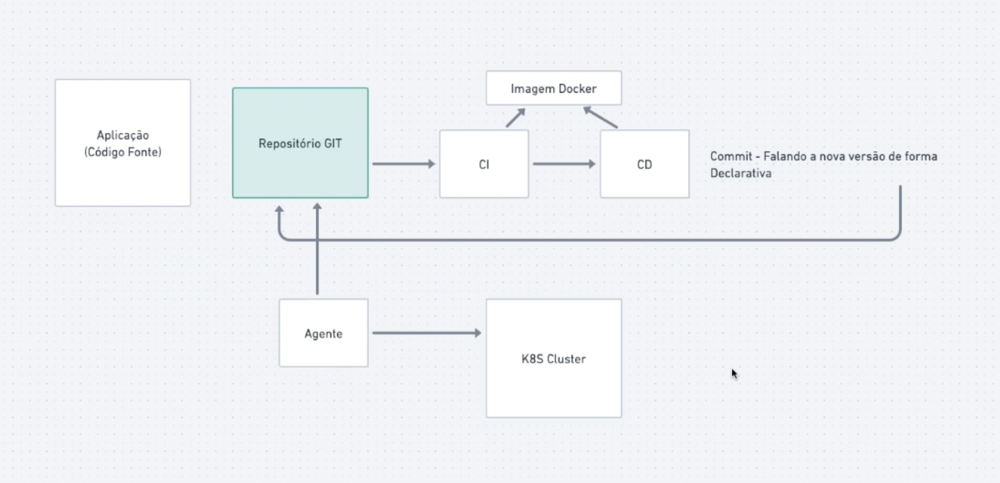

## Gitops basics




## Using Argo CD

[Documentation](https://argo-cd.readthedocs.io/en/stable/getting_started/)

````
kubectl create namespace argocd
kubectl apply -n argocd -f https://raw.githubusercontent.com/argoproj/argo-cd/stable/manifests/install.yaml
````
Install
````
brew install argocd
````
Login Using The CLI
````
argocd admin initial-password -n argocd
````
Port Forwarding
````
kubectl port-forward svc/argocd-server -n argocd 8080:443
````